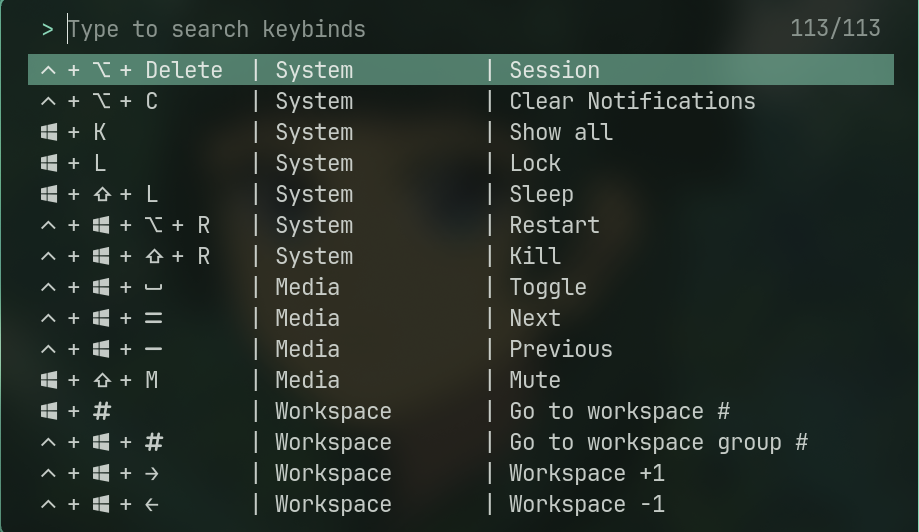

# Changes to upstream
This is a Caelestia-Cli (https://github.com/caelestia-dots/cli) fork.  
I added a window showing all i.a. hyprland keybinds.

# How to use
Edit the `keybinds.json` file with your keybinds; the scheme is generally:
```json
"Category": {
    "Description of the command": "Keys to press"
}
```

The `key_translations.json` contains a name-symbol pair to show a nicer symbol in the overview without the need to write it in the `keybinds.json`.

After editing the `keybinds.json`, run `./run.sh keybinds -g` to generate the txt-file used for the overview (You may also edit the txt directly, but I think it is too annoying).

I also made an `install.sh` to easily reinstall caelestia-cli.

<div align="center">
  
</div>
